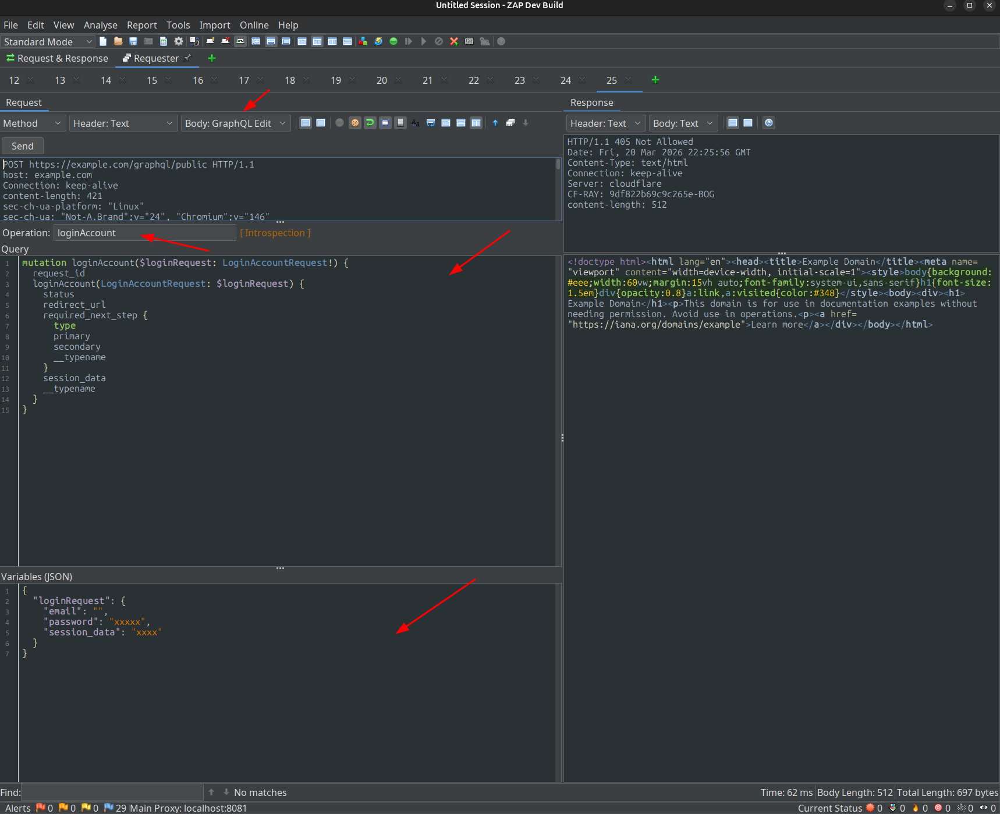
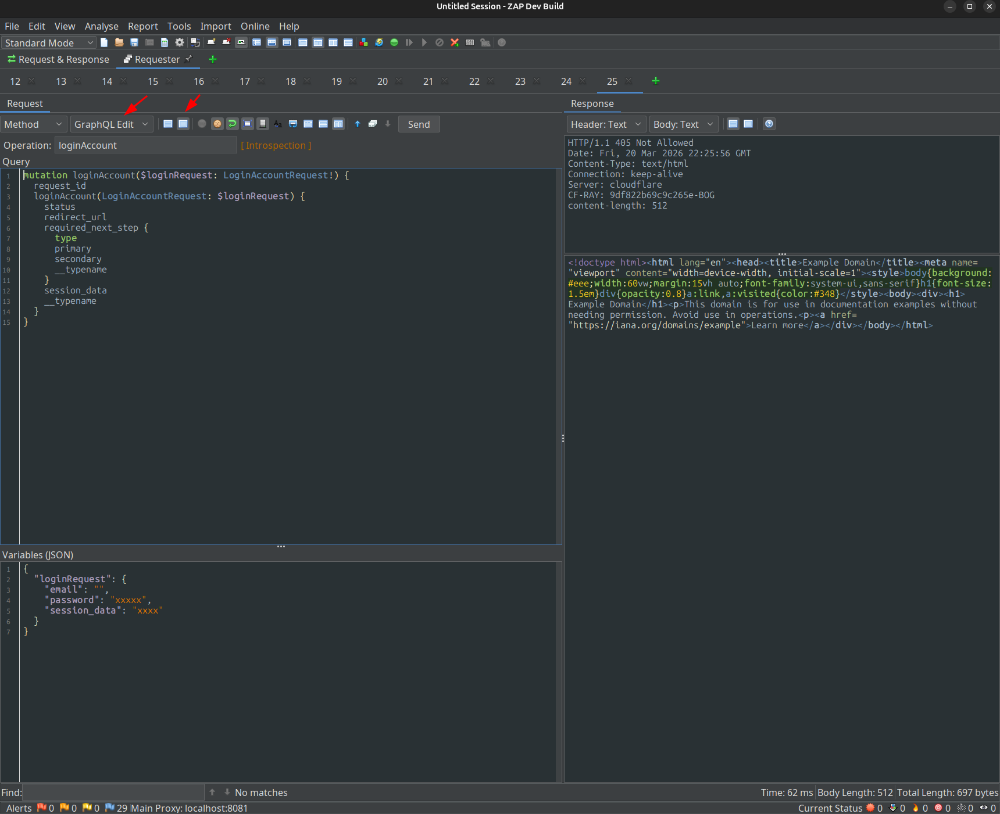

# GraphQL Edit — ZAP Add-on

Add-on para [ZAP](https://www.zaproxy.org/) que agrega una vista dedicada para editar peticiones GraphQL directamente desde el HTTP panel y el Requester.

## Características

### Vista dedicada en el HTTP Panel
- Panel dividido en dos áreas: **Query** (arriba) y **Variables JSON** (abajo)
- Campo editable de **Operation Name**
- Indicadores visuales: `[ Introspection ]` y `[ Batch: N ops ]`
- Se activa automáticamente cuando se detecta una petición GraphQL (tiene prioridad sobre la vista JSON)

### Detección automática de peticiones GraphQL
La vista se activa para:
- `POST` con `Content-Type: application/json` que incluya `"query"` o `"mutation"` en el body
- `POST` con `Content-Type: application/graphql`
- `GET` con parámetro `query=` en la URL
- Cualquier petición cuya URL contenga `/graphql`, `/gql`, `/api/graphql`, `/query`, etc.
- **Batch queries**: arrays JSON con múltiples operaciones

### Soporte GET y POST
- **POST**: lee y escribe el body JSON (`{"query": "...", "variables": {...}}`)
- **GET**: lee y escribe los parámetros `query` y `variables` directamente en la query string de la URL

### Syntax highlighting GraphQL
Resaltado de sintaxis real para el área de Query:
- Keywords: `query`, `mutation`, `subscription`, `fragment`, `on`, `type`, `input`, `enum`, `interface`, `union`, `scalar`, `directive`, `schema`, `extend`, `implements`
- Literales: `true`, `false`, `null`
- Tipos (PascalCase), variables (`$var`), strings, números, comentarios (`#`)

### Formateo automático
- El query se formatea con indentación de 2 espacios al cargar
- Las variables JSON se formatean con pretty-print
- Maneja: bloques `{}`, argumentos `()`, listas `[]`, block strings `"""`, spreads `...`, directivas `@`

### Menú contextual — "Generar Introspección"
Clic derecho sobre el área de Query muestra la opción **"Generar Introspección"**, que reemplaza el contenido con la IntrospectionQuery estándar completa (incluyendo fragmentos `FullType`, `InputValue` y `TypeRef`).

## Instalación

1. Compilar el add-on:
   ```bash
   cd zap-extensions
   ./gradlew :addOns:graphqledit1:build
   ```

2. El archivo `.zap` generado se encuentra en `addOns/graphqledit/build/`.

3. En ZAP: `Opciones → Add-ons → Instalar desde archivo` y seleccionar el `.zap`.

## Uso

1. Intercepta o abre cualquier petición GraphQL en ZAP.
2. En el HTTP panel del request, selecciona la pestaña **"GraphQL Edit"** (se activa automáticamente).
3. Edita el query en el área superior y las variables en el área inferior.
4. Clic derecho sobre el área de Query → **"Generar Introspección"** para enviar una introspección completa.





## Estructura del proyecto

```
graphqledit/
├── graphqledit.gradle.kts
└── src/main/
    ├── java/org/zaproxy/addon/graphqlEdit/
    │   ├── ExtensionGraphqlEdit.java          # Punto de entrada, registro en ZAP
    │   ├── HttpPanelGraphqlEditView.java       # Vista principal (panel Query + Variables)
    │   ├── HttpPanelGraphqlEditArea.java       # Editor base (RSyntaxTextArea)
    │   ├── HttpPanelGraphqlQueryArea.java      # Editor de query con syntax highlighting
    │   ├── GraphqlRequestViewModel.java        # Modelo unificado GET/POST
    │   ├── GenerateIntrospectionMenuItem.java  # Menú contextual de introspección
    │   └── internal/
    │       ├── GraphqlEditFormatter.java       # Formateador de queries y JSON
    │       └── GraphqlTokenMaker.java          # TokenMaker para RSyntaxTextArea
    └── resources/org/zaproxy/addon/graphqledit/resources/
        └── Messages.properties
```

## Dependencias

- ZAP 2.17.0+
- `commonlib` (add-on ZAP)
- `com.google.code.gson:gson:2.10.1`

